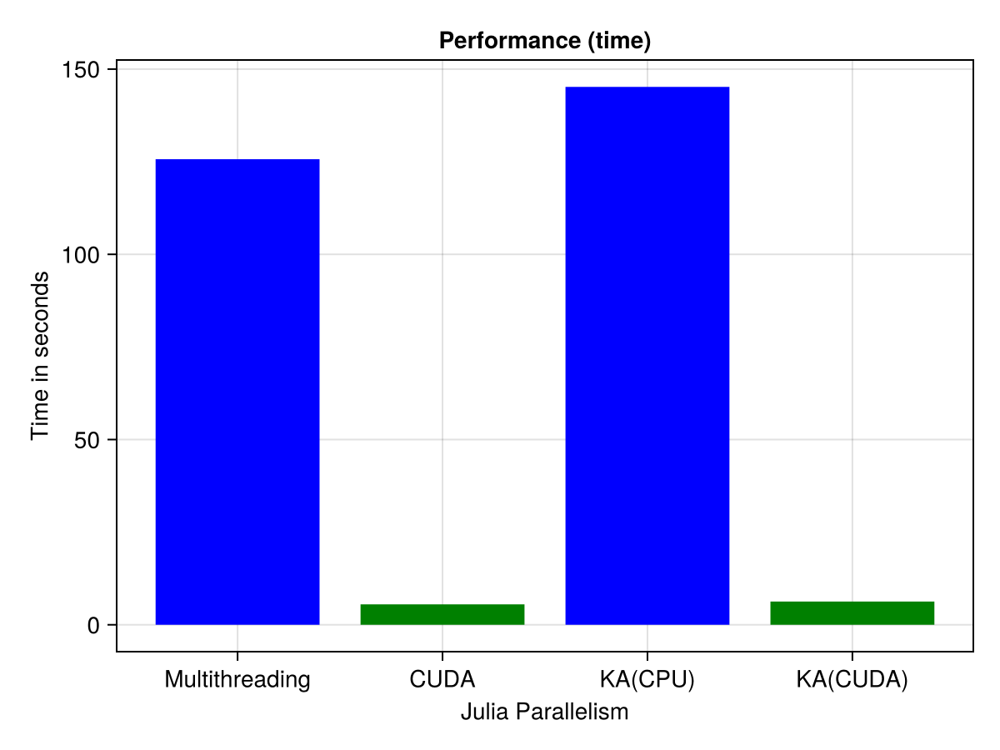
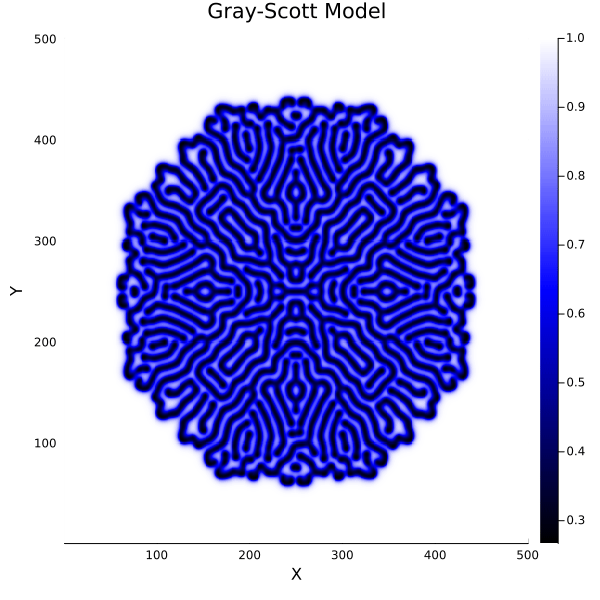
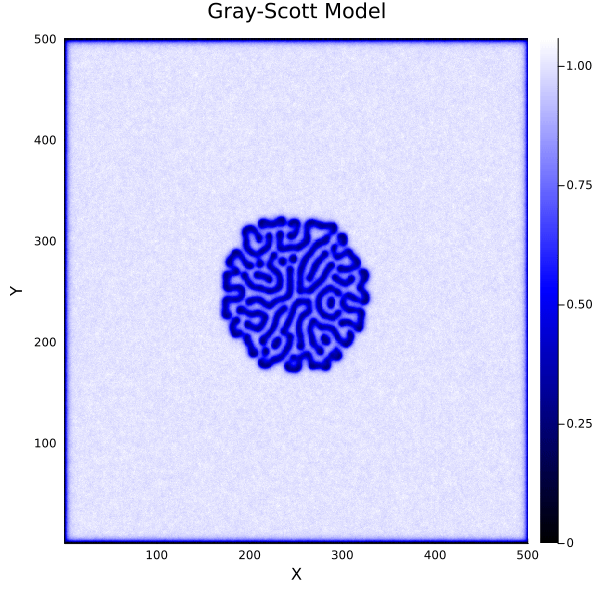
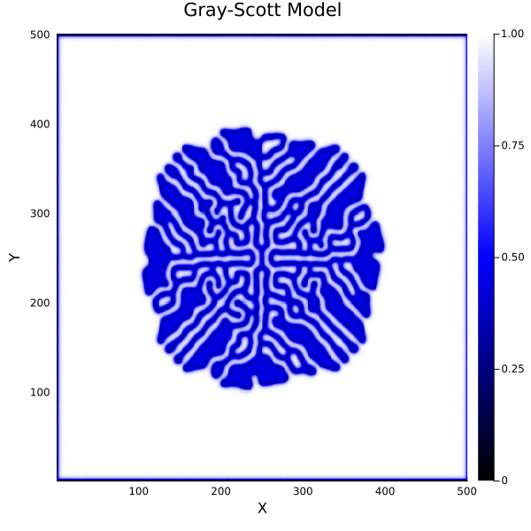

# GPU Acceleration

This section will teach you GPU programming in Julia, with a focus on using CUDA.jl and KernelAbstractions.jl.

To run the notebooks on Perlmutter, please clone this repository if you haven't done so already:

```sh
git clone https://github.com/JuliaParallel/julia-hpc-tutorial-sc24
cd julia-hpc-tutorial-sc24
```

It is recommended to access the Jupyter notebook for this section through this website:   

[NERSC Jupyter notebook](https://jupyter.nersc.gov/)

## Introduction to GPU Programming in Julia

If you're looking for an introductory overview of GPU programming in Julia or GPU programming concepts in general, feel free to explore this [notebook](https://github.com/JuliaParallel/julia-hpc-tutorial-sc24/blob/main/parts/gpu/gpu_introduction.ipynb).

## Heat Diffusion Simulation Using Julia

This [notebook](https://github.com/JuliaParallel/julia-hpc-tutorial-sc24/blob/main/parts/gpu/heat-diffusion.ipynb) demonstrates the implementation of a 2D heat diffusion model using Julia, showcasing GPU acceleration with CUDA.jl and support for both CPU and GPU execution using KernelAbstractions.jl. It highlights efficient solutions for partial differential equations (PDEs).

### Benchmarking Results

The notebook presents a series of benchmarks comparing execution times across different configurations:

1. **CPU Implementation**
   - Utilizes Julia's native array operations.
   - Serves as a baseline for performance comparison.

2. **GPU Implementation with `CUDA.jl`**
   - Employs `CUDA.jl` for direct GPU programming.
   - Demonstrates significant speedup over the CPU version.

3. **GPU Implementation with `KernelAbstractions.jl`**
   - Uses `KernelAbstractions.jl` to write code that can run on both CPU and GPU.
   - Offers flexibility with performance close to the `CUDA.jl` implementation.

Here's the plot showing the benchmark results on a single A100 GPU in Perlmutter using problem of size `10240x10240` and number of time steps `2000`:


 


### Key Takeaways

- **Performance Gains:** GPU implementations, both with `CUDA.jl` and `KernelAbstractions.jl`, exhibit substantial performance improvements over the CPU version, highlighting the advantages of GPU acceleration for computationally intensive tasks like heat diffusion.

- **Flexibility vs. Performance:** While `CUDA.jl` provides optimal performance for NVIDIA GPUs, `KernelAbstractions.jl` offers a more flexible approach, allowing code to run on multiple backends (CPU, GPU) with minimal changes, albeit with a slight performance trade-off.

- **Ease of Use:** Both packages integrate seamlessly with Julia, enabling efficient development of high-performance applications without sacrificing code readability or maintainability.


##  Gray-Scott Reaction-Diffusion Model Using Julia
This [notebook](https://github.com/JuliaParallel/julia-hpc-tutorial-sc24/blob/main/parts/gpu/gray-scott.ipynb) introduces Gray-Scott Reaction-Diffusion model using Julia. 
 
### Example Plots

The notebook showcases the evolution of the Gray-Scott model over time, illustrating the intricate patterns generated by the reaction-diffusion process. Here are some example plots:




